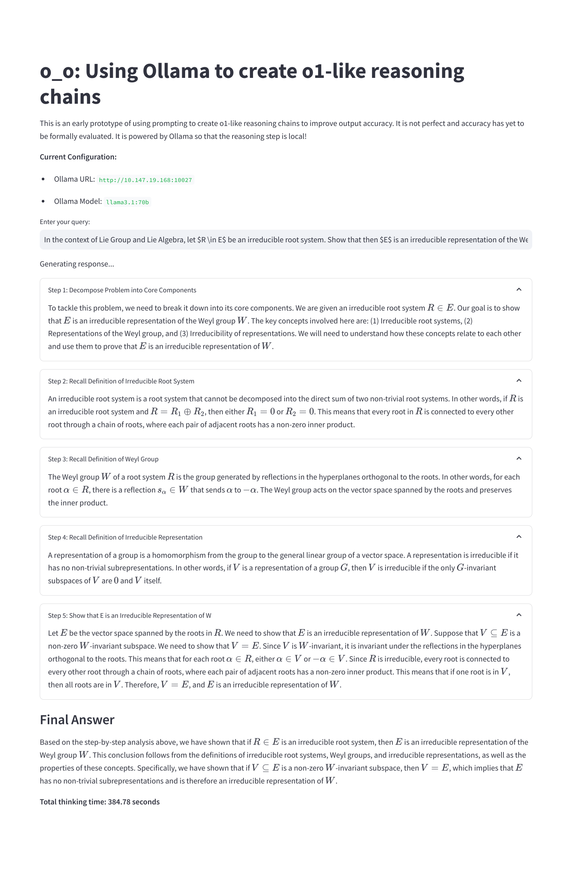
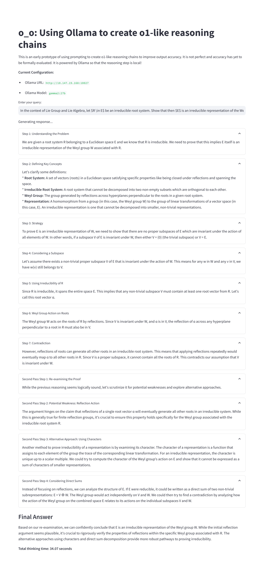
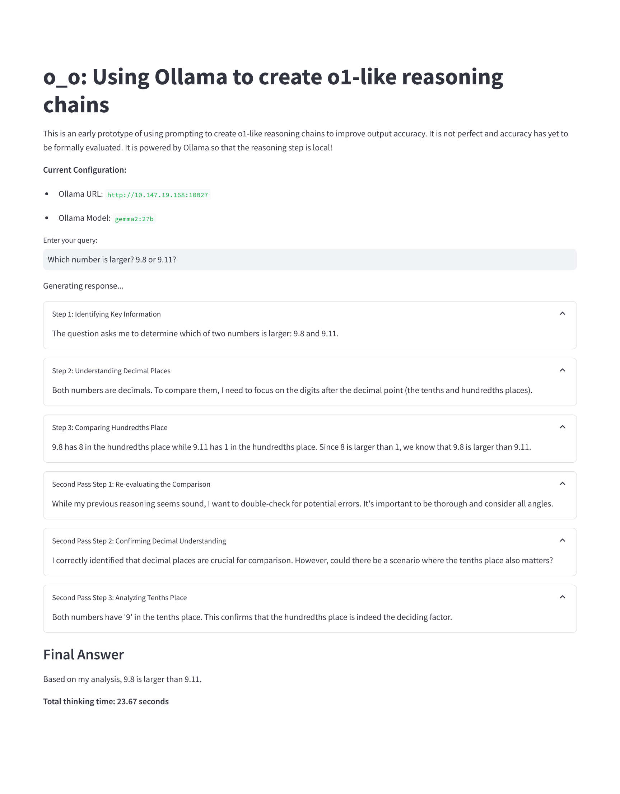
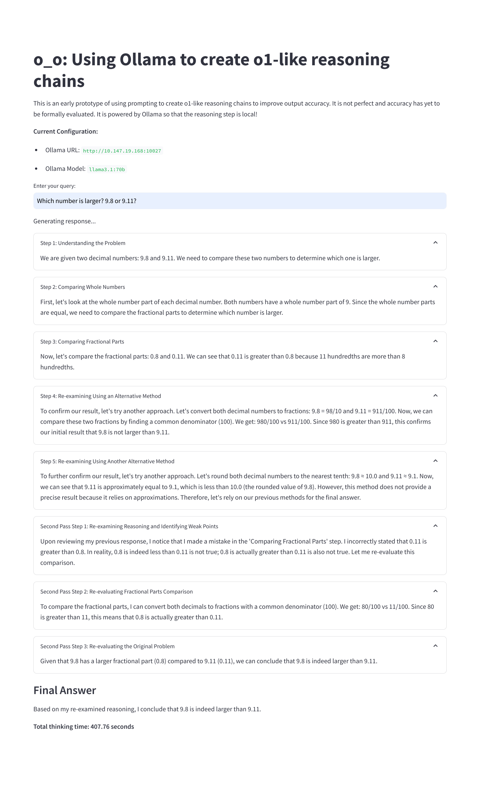

# o_o: Ollama powered O1-like reasing chains

--------


## Build up the docker image


```sh
docker build --file Dockerfile . -t  o_o
```


## Bring up the docker container

```sh
docker run --rm -it  -e OLLAMA_URL=<YOUR_OLLAMA_URL> -e OLLAMA_MODEL=<YOUR_OLLAMA_MODEL> -p <PORT>:8501 o_o
```

in which `YOUR_OLLAMA_URL` is the URL of your Ollama server (such as `http://1.2.3.4:5678`), `YOUR_OLLAMA_MODEL` is the model you want to use (should be `llama3.1:70b`, but `gemma2:27b` is also good, and should having been installed in your Ollama server), and `<PORT>` is the port on which you want to run the server.

Then visit `http://<YOUR_IP_ADDRESS>:<PORT>` in your browser to see the app.


## Examples


###  In the context of Lie Group and Lie Algebra, let $R \in E$ be an irreducible root system. Show that then $E$ is an irreducible representation of the Weyl group $W$.





### Which number is larger? 9.8 or 9.11?





## Credits

- **g1** was originally developed by [Benjamin Klieger](https://x.com/benjaminklieger).
- **multi1** fork was developed by [tcsenpai](https://github.com/tcsenpai).

